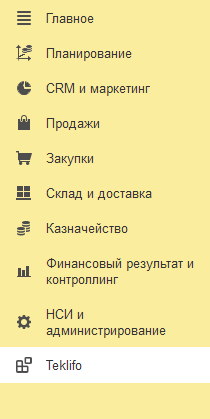

# Расширение для работы с коммерческими предложениями из 1С

Если ваша организация ведет учет своей торговой деятельности в программе 1С, то вы можете подключить к своей конфигурации специальное бесплатное расширение для обмена с Teklifo. Данное расширение в частности позволяет:

- Настроить подключение к сервису Teklifo
- Создать и опубликовать документ запроса цен поставщикам прямо из 1С
- Автоматически загрузить в 1С коммерческие предложения от поставщиков
- Найти открытые запросы цен и отправить по ним свои коммерческие предложения
- Выгрузить информацию по номенклатурным позициям

Расширение доступно для скачивания по ссылке:

👉 [**Расширение для конфигурации Управление торговлей 11.5**](https://github.com/teklifo/teklifo-1c/releases/latest/download/teklifo-1c.cfe)

О том как подключить расширение к конфигурации можно прочитать [здесь](https://42clouds.com/ru-ru/manuals/dobavlenie-rasshireniya-patcha-v-1s/).

Сразу после подключения расширения в вашей конфигурации станет доступна новая подсистема "Teklifo", в которой будут размещены все объекты, необходимые для синхронизации с сайтом.

Перед началом работы небходимо будет заполнить начальные настройки. Сделать это можно с помощью [стартового помощника](./starter)
