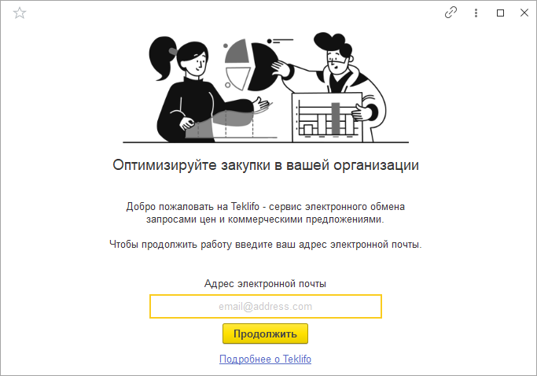
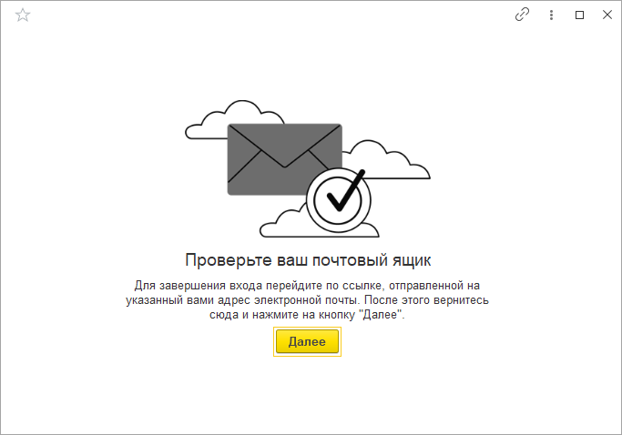
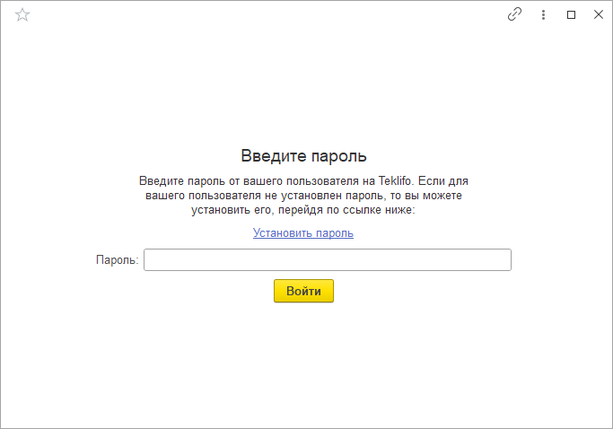
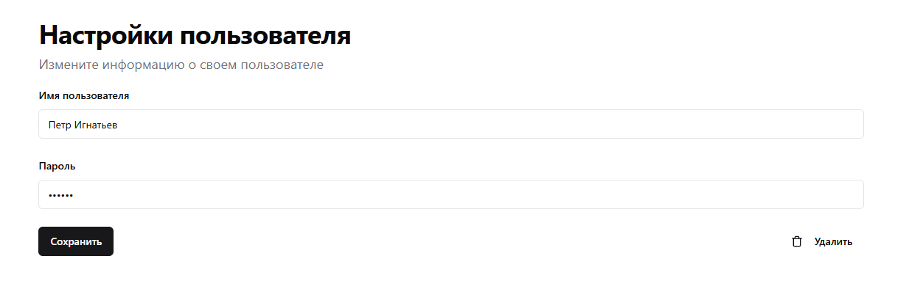
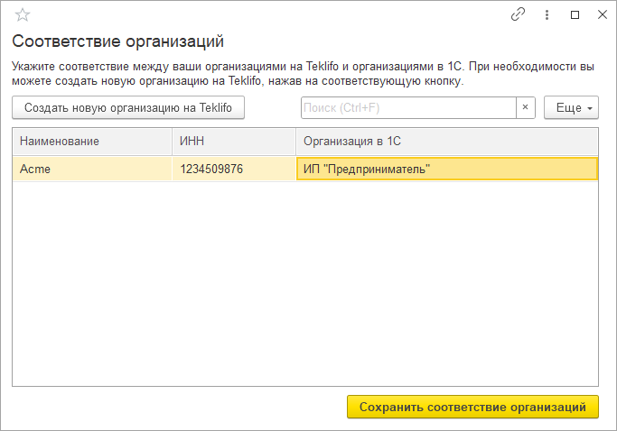
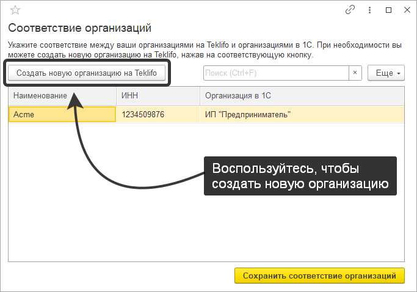
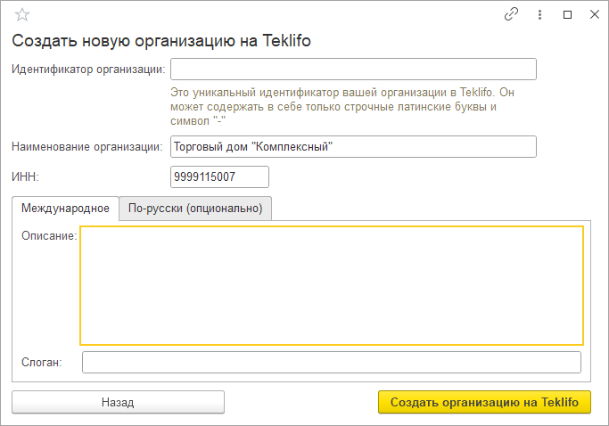

# Стартовый помощник

Стартовый помощник поможет вам авторизоваться на сайте Teklifo, завести профиль организации, а также сопоставить данные Teklifo с объектами в 1С.

Расположен стартовый помощник в подсистеме "Teklifo" → "Интеграция с Teklifo".

## Авторизация

Сразу после запуска помощника перед вами откроется окно с приветствием, где вам нужно будет ввести адрес электронной почты вашего пользователя на Teklifo.

- Если у вас уже есть профиль на сайте Teklifo, то введите в поле в нижней части формы адрес электронной почты, под которым вы были зарегистрированы. После нажатия на кнопку "Продолжить" вы перейдете к этапу ввода пароля.

- Если же вы еще не были зарегистрированы сайте, то введите ваш адрес электронной почты, под которым вы планируете продолжить работу. После нажатия на кнопку "Продолжить" на данный адрес будет отправлено письмо с ссылкой для подтверждения, о чем вас предупредит стартовый помощник. Сразу после подтверждения почтового ящика вернитесь к стартовому помощнику и нажмите на кнопку "Далее", чтобы перейти к этапу ввода пароля.

## Пароль

Чтобы завершить авторизацию необходимо будет ввести пароль вашего пользователя.

Если у вашего пользователя еще не был установлен пароль, то вы можете это сделать на [странице настроек](https://teklifo.com/ru/settings). Просто придумайте новый пароль для вашего пользователя и нажмите на кнопку "Сохранить".

После того как на сайте будет задан пароль, в 1С в одноименное поле необходимо ввести этот пароль и нажать на кнопку "Войти".

## Соответствие организаций

На следующем этапе необходимо будет указать соответствие между организациями в 1С и на Teklifo.

В открывшемся списке система автоматически выведет организации, привязанные к вашему аккаунту, а также по возможности попытается выполнить сопоставление автоматически по значению ИНН организаций.

Напротив каждой из организаций Teklifo нужно указать соответствующую организацию в колонке "Организация в 1С". После завершения сопоставления небходимо нажать на кнопку "Сохранить соответствие организаций".

## Создание новой организации

Если на Teklifo еще не был заведен профиль вашей организации, то вы можете создать его прямо из стартового помощника. Для этого на этапе сопоставления организаций воспользуйтесь кнопкой "Создать новую организацию на Teklifo".

Перед началом создания новой организации вам будет предложено выбрать одну из организаций 1С, на основании которой будут заполнены соответствующие поля формы регистрации. Далее непосредственно на форме регистрации вы сможете отредактировать все необходимые поля вручную.

Обязательными для заполнения являются поля "Идентификатор" (уникальный идентификатор вашей организации на сайте), "Наименование" и "ИНН". Дополнительно вы можете указать описание деятельности вашей организации и ее короткий слоган. После заполнения формы вы можете нажать на кнопку "Создать организацию на Teklifo" - на сервисе будет создана новая организация, а стартовый помощник вернет вас к этапу сопоставления организаций.
