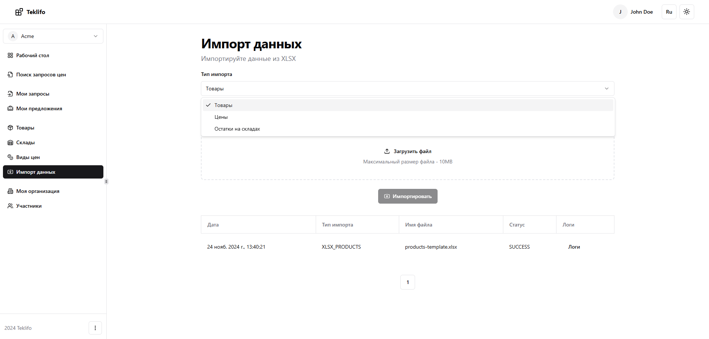

# Импорт данных

Если организация оперирует большим количеством номенклатурных позиций, то загружать информацию по каждой из них в ручном режиме сомнительное удовольствие. Тут нам на помощь приходит функционал импорта данных, доступный из соответствующего пункта меню.

Здесь нам нужно будет выбрать тип импорта, иными словами, что мы в данный момент хотим загрузить - "Товары", "Цены" или "Остатки на складах". После этого необходимо скачать и заполнить соответствующий шаблон данных в формате XLSX. Далее заполненный файл обратно загружаем на сайт через специальную область и нажимаем на кнопку "Импортировать". Результат импорта (а также полный лог процесса) будут отображены в виде таблицы в нижней части формы.
