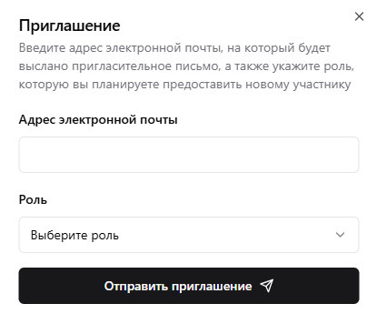

# Приглашения в организацию

Вполне возможно, что в нашем отделе закупок работает сразу несколько человек, каждому из которых необходимо предоставить доступ к профилю организации на сайте. Делается это очень просто: переходим в пункт меню "Участники" и нажимаем на кнопку "Добавить". Откроется диалоговое окно, в котором нужно будет указать адрес электронной почты того участника, которого мы хотим пригласить в нашу организацию, а также права доступа для него (пока для выбора доступны только полные права "Full access"). Нажимаем "Отправить приглашение", после чего на указанный адрес будет отправлено письмо со специальной ссылкой. Перейдя по этой ссылке пользователь сможет подтвердить согласие на вступление в вашу организацию.
