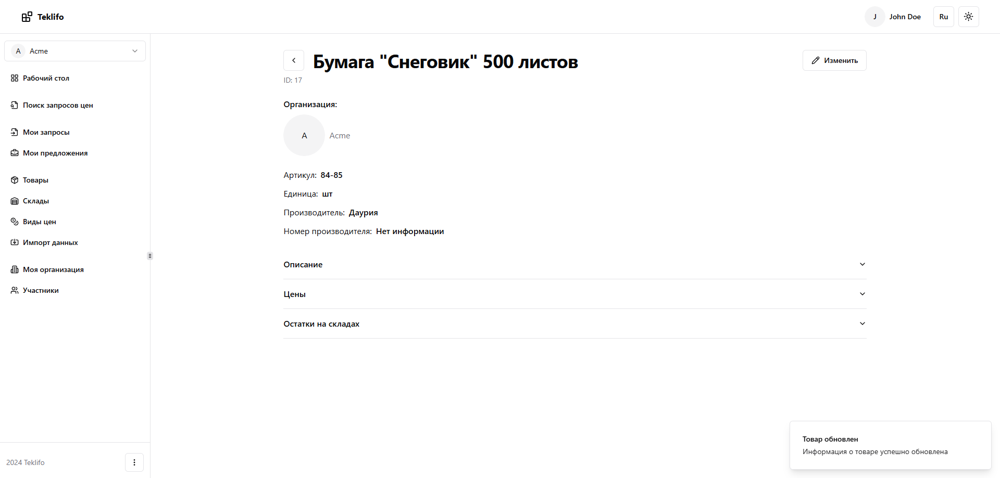

# Товары

Допустим, что наша организация закупает канцелярские товары на регулярной основе, и потому прекрасно знает конкретные экземпляры товара, которая она может приобрести. В таком случае будет непрактично в каждом новом запросе цен заполнять наименование товарных позиций в виде произвольной строки. Это приведет к непостоянности, в следствие того, что каждый раз одна и та же номенклатура может быть указана слегка иначе, чем в прошлый раз, что приведет в итоге к проблемам при анализе закупок. Поэтому будет намного практичнее завести на сайте элемент нашего товара в виде некой сущности и именно ее указывать в запросах цен.

Перейти к созданию товара можно из пункта меню "Товары" -> "Добавить" -> "Создать товар".

В карточке товара нужно будет заполнить его наименование, артикул и единицу измерения. Дополнительно можно указать информацию о производителе, внутренний идентификатор (например, GUID из 1С) и текстовое описание.

Уже после создания товара можно перейти к заполнению информации об установленных на него ценах и его текущих остатках на складах. Для этого нужно будет сначала завести список видов цен и складов. Делается это из соответствующих пунктов меню "Виды цен" и "Склады". Когда виды цен и склады будут заведены, можно будет воспользоваться кнопками "Изменить цены" и "Изменить остатки на складах", доступными из карточки товара. При нажатии на них будут открыты соответствующие формы заполнения данных.
