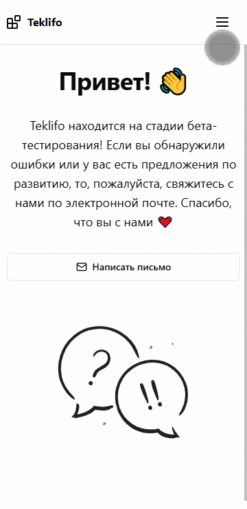
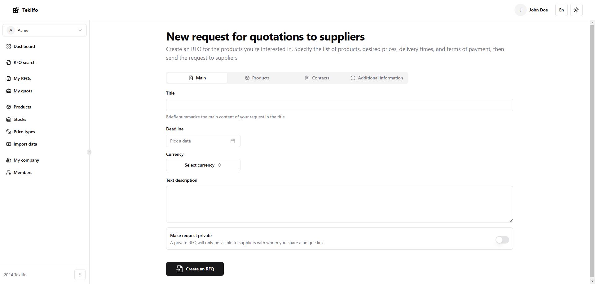
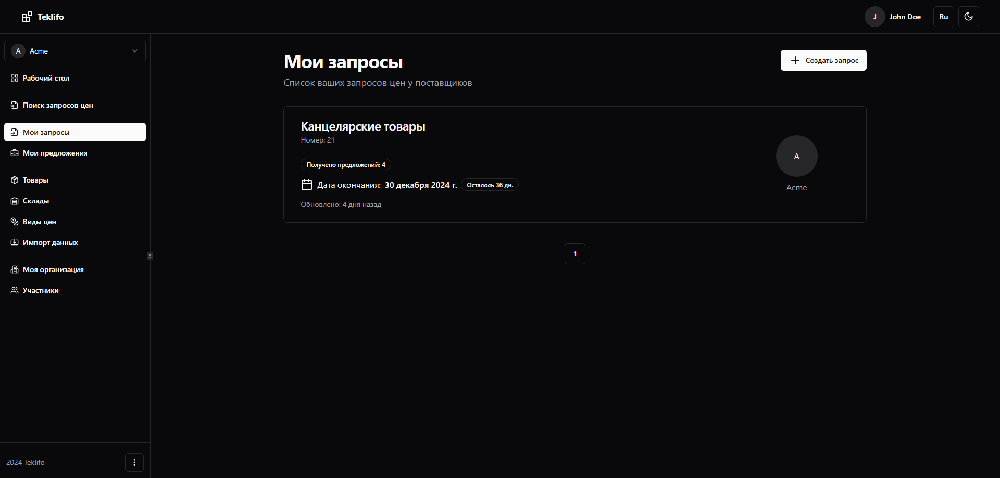
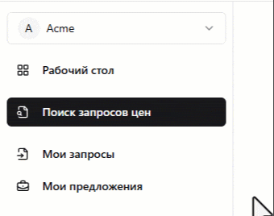

# Немного о UX

Теперь давайте отвлечемся от описания основного функционала и расскажем о некоторых "плюшках", которые позволят сделать использование приложения чуть более удобным.

## Адаптивность

Сайт адаптирован под использование на устройствах самого разного размера экрана.

## Переключение языков

Teklifo полностью переведен на английский язык. Чтобы переключиться между языками, воспользуйтесь кнопкой в правом верхнем углу.

## Темная тема

В правом верхнем углу, расположена кнопка для переключения на темную тему - мелочь, а приятно.

## Панель меню

Если панель слева занимает слишком много места, то ее можно спрятать.

