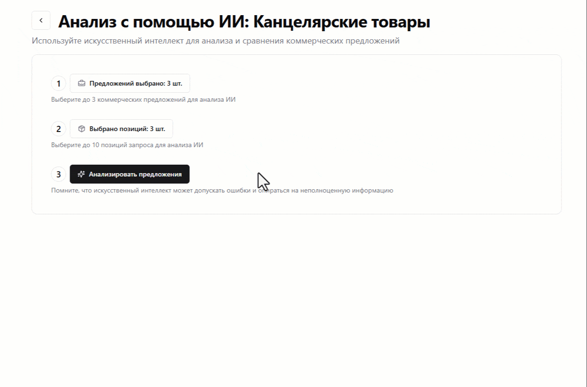

# ✨ Анализ коммерческих предложений от ИИ

Нет времени сидеть и самому сравнивать предложения по каждой из позиций? Тогда доверьте это дело ИИ.

Для этого на странице запроса цен нажимаем на кнопку "Анализировать с помощью ИИ". Перед нами откроется страница с панелью, в которой будут перечислены три простых шага:

1. Нужно выбрать до трех коммерческих предложений, которые мы хотим сравнить между собой. Для этого нажимаем на соответствующую кнопку и в открывшемся окне подбираем интересующие нас коммерческие предложения.
2. Выбираем до 10 позиций запроса цен, по которым мы будем сравнивать предложения. В открывшемся окне отмечаем галочками позиции запроса к анализу.
3. Запускаем анализ предложений.

