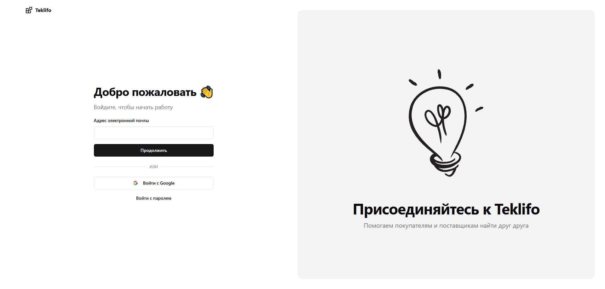

# Авторизация

Для авторизации на Teklifo необходимо перейти по следующей ссылке:
https://teklifo.com/ru/login

Тут у нас есть два варианта: авторизация по адресу электронной почты или же через аккаунт Google.

- Если выбираем первый вариант, то вводим адрес нашей электронной почты в соответствующее поле и нажимаем на кнопку "Продолжить". В ответ на указанный адрес придет письмо с уникальной ссылкой, перейдя по которой мы вернемся обратно на сайт Teklifo, но теперь система автоматически определит нас, как авторизованного пользователя.
- Авторизация через Google еще проще: просто нажимаем на кнопку "Войти с Google", выбираем в открывшемся окне свой профиль – и мы авторизованы.

Теперь можно перейти к созданию [профиля организации](./company), от лица которой мы и будем вести торговую деятельность, о чем нас, собственно, и уведомляет сообщение на странице рабочего стола.
