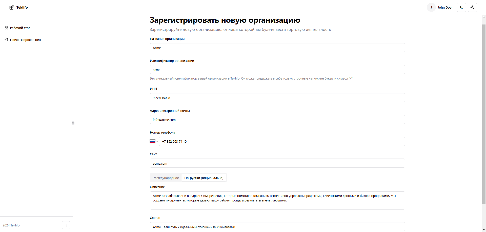
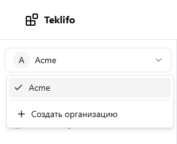

# Профиль организации

Создать новую организацию можно из страницы "Мои организации". Для этого нужно в правом верхнем углу нажать на кнопку с именем нашего пользователя и в раскрывшемся меню выбрать пункт "Мои организации". После этого мы перейдем на страницу, где будут отображены все организации, участниками которых мы являемся. На текущий момент таких организаций нет, поэтому мы создадим новую, нажав на кнопку "Зарегистрировать организацию".

На странице регистрации организации нам нужно будет заполнить следующие поля:

- **Название организации** – собственно имя нашей организации, как оно будет отображено на сайте для всех пользователей.
- **Идентификатор организации** – это уникальное значение, которое позволит идентифицировать нашу организацию. В нем разрешено использовать только строчные буквы латинского алфавита и символ "-". Также этот идентификатор будет использоваться в различных URL на страницах сайта. Например, URL профиля нашей организации с идентификатором "acme" будет выглядеть следующим образом:
  https://teklifo.com/ru/company/acme
- **ИНН** – тут все понятно, это номер налогоплательщика нашей организации.
- **Адрес электронной почты, номер телефона и веб-сайт** нужны чтобы наладить обратную контактную связь между организациями.

Описание и слоган не обязательны к заполнению, однако их заполнение поможет другим пользователям понять, чем занимается организация, какие услуги или товары она предлагает и чем отличается от конкурентов. Указать их можно в двух вариантах – международном и локализованном (на русском).

Итак, после заполнения всех требуемых полей мы нажимаем в самом низу формы на кнопку "Зарегистрировать организацию", и если мы все сделали правильно, то наша организация будет успешно зарегистрирована, а мы будем перенаправлены на страницу ее профиля.

После создания организации можно также заметить, что панель слева стала заметно более информативной: в ней появилось сразу несколько новых пунктов меню. По каждому из них мы пройдемся в отдельности, но первое, на что сейчас стоит обратить внимание, это переключатель организаций в верхней части панели.

Прямо сейчас мы являемся участником только одной организации, и все наши действия на сайте мы будет выполнять от ее лица. Однако если бы мы состояли сразу в нескольких организациях, то именно из этого меню мы могли бы быстро между ними переключиться. Кроме того, для удобства здесь также располагается кнопка быстрого перехода к регистрации новой организации.
