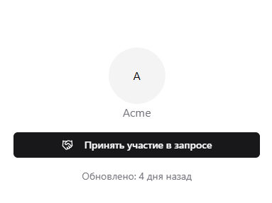

# Участие в запросе

Теперь посмотрим на ситуацию с другой стороны, а именно с точки зрения поставщика. Представим, что мы являемся представителем магазина канцелярских товаров "Скрепка", в которую поступил тот самый запрос цен от организации "Acme". В письме с приглашением принять участие в запросе заказчик оставил ссылку на сайт, где мы и должны будем разместить наше коммерческое предложение в электронном виде.

Перейдя по этой ссылке, мы увидим все ту же самую страницу запроса цен, но состав доступных команд для нас, как для поставщика, будет, разумеется, совершенно иной, а точнее нам будет доступна сейчас лишь одна команда – "Принять участие в запросе".

Таким образом, чтобы отправить коммерческое предложение мы должны будем сначала подтвердить наше участие в данном запросе цен. Однако так как до этого момента мы не были зарегистрированы, то предварительно нам нужно будет [авторизоваться](./authentication) в системе и завести в ней [профиль организации](./company) "Скрепка".

Итак, авторизуемся, создаем профиль организации "Скрепка", подтверждаем участие в запросе цен и вот, наконец, нам становится доступна новая команда "Подготовить коммерческое предложение", при нажатии на которую открывается окно [составления коммерческого предложения](./quotation).
