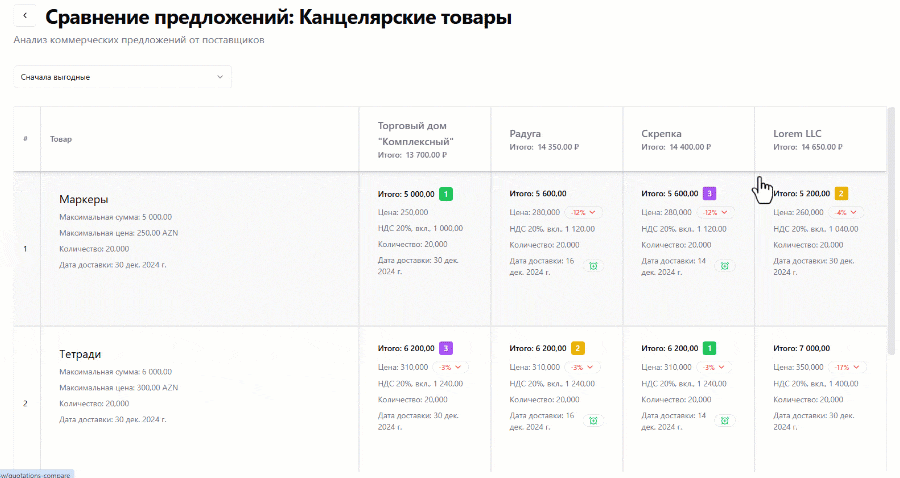

# Сравнение коммерческих предложений

Мысленно перенесемся немного вперед во времени и представим, что компании Acme удалось собрать уже целых четыре коммерческих предложения на свой запрос цен. Вполне достаточное количество для того, чтобы сравнить их между собою.

Для этого на сайте предусмотрена специальная форма, перейти к которой можно из страницы запроса цен, нажав на кнопку "Сравнить предложения".

На странице сравнения предложений расположена матрица, в которой в виде строк перечислены запрошенные товары, а каждая из колонок представляет собой одно из полученных коммерческих предложений. В пересечении же строк и колонок, таким образом, отображается предложение по позиции.

В заголовках колонок отображается имя организации, отправившей коммерческое предложение, а также итоговая сумма самого предложения. При нажатии на колонку будет открыт профиль организации-поставщика, где о ней можно будет узнать дополнительную информацию.

В ячейках запрошенных товаров отображается, собственно, название запрошенной позиции, требуемое количество, максимальная цена, дата доставки, а также путем нехитрого умножения цены на количество выводится максимальная сумма, которую заказчик готов выложить за данную позицию.

В ячейках предложений выводится информация с тем же составом, плюс сведения о ставке НДС. При наведении мышкой на такую ячейку появляется всплывающая кнопка "Подробнее", нажав на которую можно просмотреть коммерческое предложение полностью.

Колонки коммерческих предложений можно отсортировать по их итоговой сумме или же по дате их создания. Для этого нужно воспользоваться полем выбора, расположенном над матрицей предложений.

Кроме того, для упрощения сравнения предложений, внутри ячеек выводятся специальные бейджики:

- Топ-3 самых выгодных предложения по позиции получают бейджики с номером занимаемых ими позиций.
- В случае если предложенная цена товара отличается от запрошенной, то в ячейке также будет отображен соответствующий бейджик, отображающий в процентном соотношении разницу между запросом и предложением. Зеленый бейджик означает, что цена ниже запрошенной, красный - выше.
- Бейджик, уведомляющий о разнице в дате доставке, работает по тому же принципу, что и бейджик о разнице цен: красный будильник означает задержку, зеленый же - доставку раньше срока.

:::tip[Особенности пагинации]

Стоит обратить внимание, что матрица использует пагинацию (разбиение данных по страницам) сразу в двух измерениях – по строкам и по колонкам. На странице отображается от 10 до 50 товарных позиций на страницу (настраивается в специальном поле выбора). А по колонкам на страницу отображается по 10 коммерческих предложений. Пагинация по строкам расположена под матрицей предложений, а пагинация по колонкам - в самом низу формы.

:::
