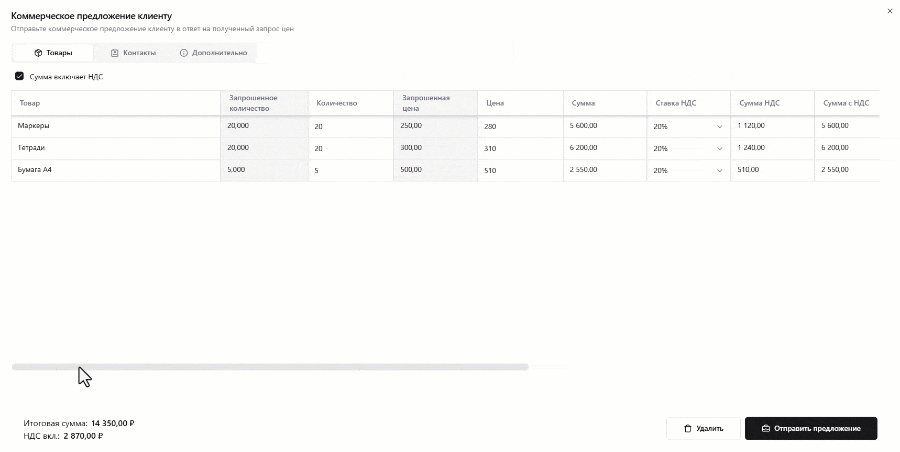

# Коммерческое предложение

Форма коммерческого предложения разбита на три вкладки: "Товары", "Контакты" и "Дополнительно". Конечно, наибольший интерес для нас представляет в первую очередь табличная часть товаров.

При открытии форма автоматически заполняется теми товарами, которые заказчик указал в своем запросе цен. Так, в колонках "Товар", "Запрошенное количество", "Запрошенная цена" и "Запрошенная дата доставки" отображаются значения из запроса цен. Редактировать их нельзя. Для нас, как для поставщиков, эти колонки несут скорее информативный характер и нужны для того, чтобы на их основании понять потребность клиента.

Свое количественное и ценовое предложение по запрошенным позициям мы указываем, соответственно, в колонках "Цена" и "Количество". Кроме того, в соответствующей колонке требуется указать ставку НДС. Если указанные нами цены уже включают в себя НДС, то в верхней части вкладки необходимо установить галочку "Сумма включает НДС".

На основании введенных данных автоматически будет рассчитана сумма НДС и итоговая сумма для каждой строки табличной части. Итоговые же суммы по всему коммерческому предложению в целом можно просмотреть в левом нижнем углу формы.

Далее необходимо указать дату доставки по каждой из позиций (по умолчанию наша дата доставки равна запрошенной дате) и при необходимости комментарий.

В случае если мы понимаем, что не можем предоставить предложение по какой-либо из позиций запроса, то напротив данной строки необходимо установить галочку "Пропустить позицию".

На вкладке "Контакты" нужно будет заполнить поля "Контактное лицо", "Номер телефона" и "Адрес электронной почты", а на вкладке "Дополнительно" можно оставить текстовый комментарий для заказчика.

Заполнив все поля формы должным образом, нажимаем на кнопку **"Отправить предложение"** в нижней части формы. В открывшемся диалоговом нужно будет подтвердить наше намерение, после чего коммерческое предложение будет сформировано.

Созданное коммерческое предложение можно просмотреть на вкладке "Мои предложения" внутри [страницы запроса цен](./rfq-page), где оно будет отображено в виде карточки. При нажатии на эту карточку вновь будет открыта форма коммерческого предложения, где поставщик сможет при необходимости внести в него корректировки или же полностью его удалить, нажав на соответствующую кнопку в нижней части формы.
