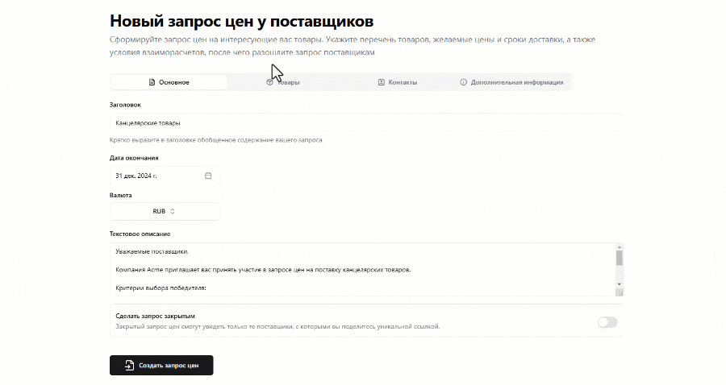

# Запрос цен

Теперь мы, наконец, можем приступить к созданию запроса цен (он же RFQ - Request for quotation). Для этого в панели слева выбираем пункт меню "Мои запросы", а затем, после перехода на страницу запросов, нажимаем на кнопку "Создать запрос".

Форма создания запроса разбита на несколько вкладок – "Основное", "Товары", "Контакты" и "Дополнительная информация".

## Основное

На вкладке "Основное" заполняем следующие поля:

- **Заголовок** – короткое и содержательное описание нашего запроса цен, по которому поставщики моментально смогут понять, в чем заключается суть нашей потребности. Например, в случае нашей организации Acme, мы можем написать просто "Канцелярские товары".
- **Дата окончания** – дата и точное время окончания приема коммерческих предложений по данному запросу цен.
- **Валюта** – валюта запроса.
- **Текстовое описание** – в этом поле, в отличие от заголовка, можно уже более развернуто рассказать о нашем запросе. Например, можно сообщить об определенных особенностях проведения запроса или о факторах принятия окончательного решения при выборе поставщиков.

Отдельно стоит обратить внимание на переключатель **"Сделать запрос закрытым"**. Его имеет смысл установить тогда, когда мы намеренно хотим ограничить круг организаций, которые получат доступ к нашему запросу цен. При установке этого значения запрос смогут просмотреть только те организации, с которыми вы поделитесь ссылкой.

## Товары

Далее нам нужно будет заполнить табличную часть товаров на одноименной вкладке. Чтобы добавить новую строку в табличную часть нажимаем на кнопку "Добавить позицию" и заполняем в появившейся строке следующие колонки:

- **Товар** – наименование номенклатурной позиции, по которой мы хотим получить предложения от поставщиков. Поле можно заполнить как произвольный текст или же подобрать номенклатуру из списка [товаров организации](../additional-features/products).
- **Количество** – это количество товара, которое планирует закупить наша организация.
- **Цена** – предпочтительная цена закупки с точки зрения нашей организации, на которую должны будут ориентироваться потенциальные поставщики.
- **Дата доставки** – предпочтительная дата доставки товара.
- **Комментарий** – произвольный текстовый комментарий к позиции запроса.

В самой последней колонке табличной части расположена кнопка удаления строки.

## Контакты

Переходим на вкладку контактов. Здесь нам нужно будет заполнить имя контактного лица, ответственного за данный запрос цен, а также номер телефона и адрес электронной почты, по которым поставщики смогут связаться с нами для уточнения деталей запроса. По умолчанию контактная информация заполняется сведениями из организации заказчика.

## Дополнительная информация

На данной вкладке обязательным является только поле "Адрес". В поля "Условия доставки" и "Условия оплаты" мы можем вписать дополнительные комментарии для поставщиков об особенностях доставки и оплаты соответственно.

Далее нажимаем на кнопку "Создать запрос цен", расположенную в самом низу формы, и подтверждаем создание запроса в диалоговом окне. Вуаля, запрос цен готов.
